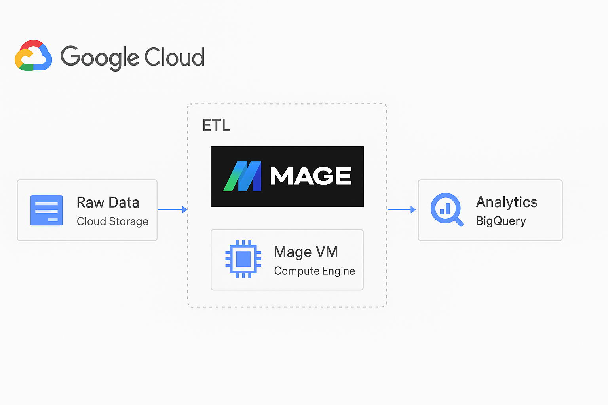
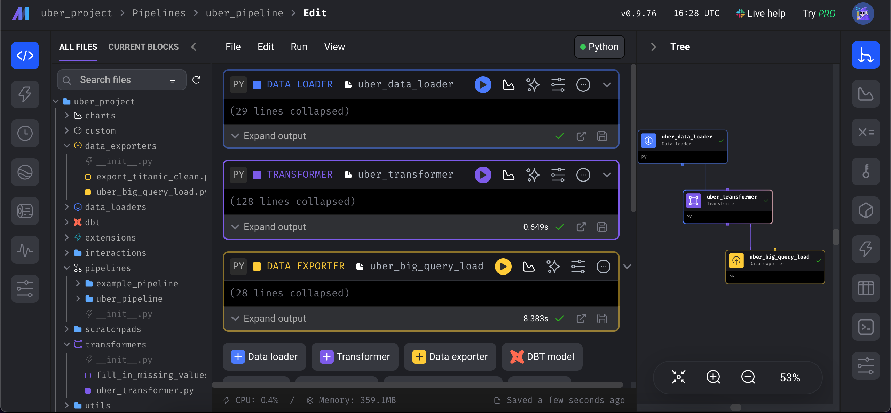

# 🚕 Uber ETL Project with Mage & Google Cloud


## Overview
This project demonstrates how to build a full ETL pipeline using **Mage AI**, **Google Cloud Platform (GCP)**, and **BigQuery**.  
The goal is to extract Uber trip data, transform it into **dimension tables** and a **fact table**, and load it into BigQuery for further analysis.

---

## 📊 Project Workflow
1. **Data Preparation**: Edited and explored data using **Jupyter Notebook**.
2. **Data Modeling**: Created **dimension tables** and a **single fact table** following a star schema.
3. **Google Cloud Setup**:
   - Created a new GCP project (`uber_project`).
   - Configured a **VM instance** using **Compute Engine**.
4. **VM & Environment Setup**:
   - Connected to the VM via SSH.
   - Created a **virtual environment**.
   - Installed required dependencies.
5. **Mage AI Setup**:
   - Initialized Mage with `mage start uber_project`.
   - Built ETL pipeline (`uber_ETL`) with:
     - **Loader** (to fetch data from Google Cloud Storage).
     - **Transformer** (to generate dimensions + fact table).
     - **Exporter** (to load results into BigQuery).
6. **BigQuery Integration**:
   - Connected Mage to BigQuery via service account & `io_config.yaml`.
   - Loaded all **dimension tables** and the **fact table** into BigQuery.

---

## 🖼️ Project Architecture

High-level architecture showing how data flows from Cloud Storage → Mage → BigQuery:



---

## 🧩 ETL Pipeline in Mage AI

Visualization of the ETL workflow (`uber_ETL`) inside the **Mage AI interface**:



---

##  BigQuery Table Schema

Here’s the schema view for the `datetime_dim` table in BigQuery:


--- 
## ⚙️ Environment Setup on VM

Run the following commands step by step on wer VM instance (via SSH):

```bash
# Update packages
sudo apt-get update

# Install Python dependencies
sudo apt-get install python3-distutils
sudo apt-get install python3-apt
sudo apt-get install wget

# Install pip
wget https://bootstrap.pypa.io/get-pip.py
sudo python3 get-pip.py

# Install Mage AI
sudo pip3 install mage-ai

# Install Pandas
sudo pip3 install pandas

# Install Google Cloud Libraries
sudo pip3 install google-cloud
sudo pip3 install google-cloud-bigquery
```

##  🚀 Running Mage
```bash
mage start uber_project
```
This will launch the Mage AI interface where we can create and run wer pipelines.

## 📂 ETL Pipeline (uber_ETL)
1. Loader
   - Loads Uber dataset from Google Cloud Storage.

3. Transformer

   - Cleans and transforms the dataset.
   
   - Creates the following tables:
   
   - Datetime Dimension
   
   - Passenger Count Dimension

   - Trip Distance Dimension
   
   - Rate Code Dimension
   
   - Pickup Location Dimension
   
   - Dropoff Location Dimension
   
   - Payment Type Dimension
   
   - Fact Table (joining all dimensions)

3. Exporter
   - Loads all tables into BigQuery:
   - Dataset: uber_dataset_project
   - Tables: All dimensions + fact table


## 🛠️ Tools & Technologies

| Tool / Technology     | Usage                                                                 |
|------------------------|----------------------------------------------------------------------|
| **Jupyter Notebook**   | Initial data exploration, cleaning, and preprocessing                 |
| **Python (pandas)**    | Data manipulation, transformations, and preparation                   |
| **Mage AI**            | ETL orchestration (Loader, Transformer, Exporter pipelines)           |
| **Google Cloud Storage** | Storage for raw Uber dataset                                         |
| **Google Compute Engine (VM)** | Virtual machine to run Mage AI and ETL pipelines              |
| **BigQuery**           | Data warehouse for storing fact & dimension tables (star schema)      |
| **Star Schema**        | Data modeling with fact table + dimension tables                      |
| **Service Account & IAM** | Secure authentication between Mage and Google Cloud services        |

